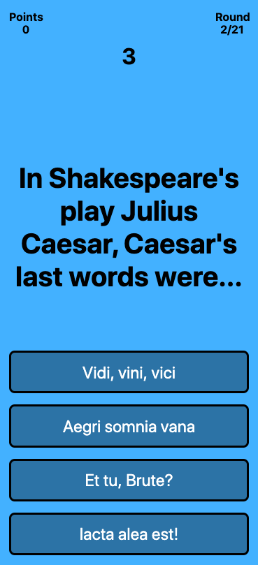

# Trivia App
[Live Mobile Version](https://morning-reef-95781.herokuapp.com/)

|||
|---|---|

<br>

## Installing and Dependencies
---

### Required - node 12.x
---

### Navigate to the root directory and run the following in your terminal:

>*Install dependencies*
```
npm install
```
>*Run webpack build*
```
npm run build-prod
```
>*Start the server*
```
npm start
```

Open the file `client/dist/index.html` or `http://localhost:80` in your browser
